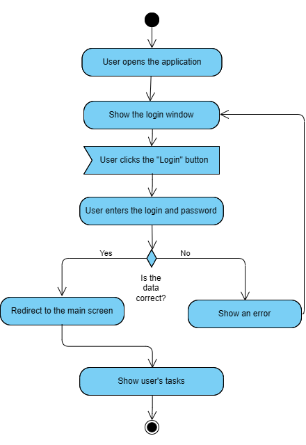
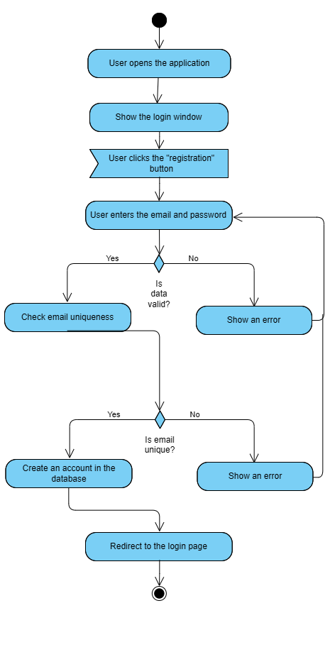
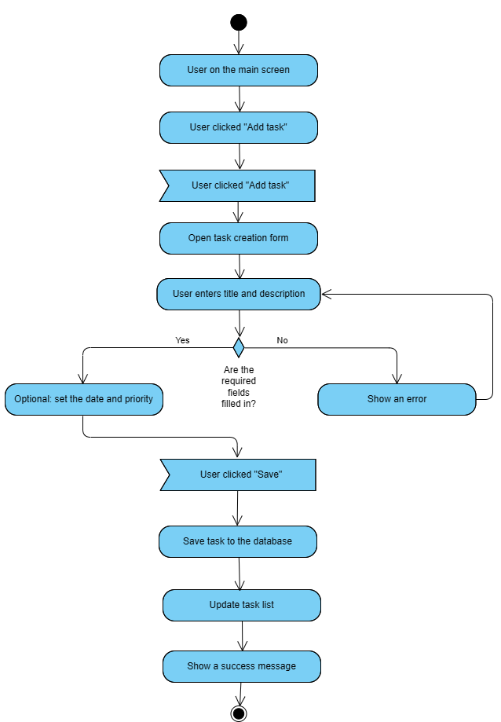

# Activity diagrams    

# Content
1. [Account Login](#1)
2. [Registration in the app](#2)
3. [Adding a task](#3)

### 1. Login to the account

### 2. Registration in the application

### 3. Adding a task

