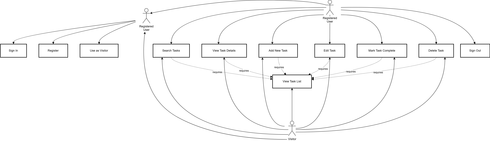

# Diagram of use cases

# Glossary

| Term | Definition |
|:--|:--|
| User | A person using the application |
| Registered User | A user who has created an account in the application |
| Visitor | A user using the application without authentication |  
| Task List | A collection of tasks belonging to a registered user |
| Task | An individual item with description, status, and optional metadata |

# Event Flow

# Table of Contents
1 [Actors](#actors)  
2 [Use Cases](#use-cases)  
2.1 [Sign in to account](#sign-in-to-account)  
2.2 [Register new account](#register-new-account)    
2.3 [Use as visitor](#use-as-visitor)  
2.4 [View task list](#view-task-list)  
2.5 [Search tasks](#search-tasks)  
2.6 [View task details](#view-task-details)     
2.7 [Add new task](#add-new-task)  
2.8 [Edit task](#edit-task)  
2.9 [Mark task complete](#mark-task-complete)  
2.10 [Delete task](#delete-task)  
2.11 [Sign out of account](#sign-out-of-account)  

<a name="actors"/>

# 1 Actors

| Actor | Description |
|:--|:--|
| User | A person using the application |
| Visitor | A user who uses the application without registration |
| Registered User | A user who has registered in the application |

<a name="use-cases"/>

# 2 Use Cases

<a name="sign-in-to-account"/>

## 2.1 Sign in to account

**Description.** The "Sign in to account" use case allows a user to access their registered account.  
**Preconditions.** The user has selected the "Sign in" option to access the application.  
**Main Flow.**
1. The application displays the login screen;
2. The user enters their username and password;
3. The user confirms the credentials;
4. The application validates the credentials;
5. The application assigns the user "registered" status;
6. The application hides the login screen;
7. The use case ends.

**Additional Information.** The user can cancel the action before confirming credentials. In case of cancellation, alternative flow A1 is executed.

**Alternative Flow A1.**
1. The application hides the login screen;
2. The use case ends prematurely.

**Postconditions.** The "[View task list](#view-task-list)" use case is executed.

<a name="register-new-account"/>

## 2.2 Register new account

**Description.** The "Register new account" use case allows a user to create a new account in the application.  
**Preconditions.** The user has selected the "Sign up" option to access the application or a visitor has expressed desire to register by selecting the "Sign up" menu option.  
**Main Flow.**
1. The application displays the registration screen requesting username, email and password;
2. The user enters their information;
3. The user confirms the information;
4. The application checks if the username/email already exists. If a match is found, alternative flow A2 is executed;
5. The application creates a user profile;
6. The application assigns the user "registered" status;
7. The application hides the registration screen;
8. The use case ends.

**Alternative Flow A2.**
1. The application notifies the user that a user with this username/email already exists;
2. The application requests the user to enter different information;
3. Return to step 2 of the main flow.

**Additional Information.** The user can cancel the action before confirming information entry. In case of cancellation, alternative flow A3 is executed.

**Alternative Flow A3.**
1. The application hides the registration screen;
2. The use case ends prematurely.

<a name="use-as-visitor"/>

## 2.3 Use as visitor

**Description.** The "Use as visitor" use case allows a user to access the application without registration.  
**Preconditions.** The user has selected the "Continue as visitor" option to access the application.  
**Main Flow.**
1. The application assigns the user "visitor" status;
2. The use case ends.

<a name="view-task-list"/>

## 2.4 View task list

**Description.** The "View task list" use case loads and displays the user's tasks.  
**Preconditions.** The user has signed in to the application or a registered user has modified their task list.  
**Main Flow.**
1. The application retrieves the task list from the user's profile;
2. The application displays the tasks in the main application window. If the list is empty, alternative flow A4 is executed; 
3. The use case ends.

**Alternative Flow A4.**
1. The application displays a message to the user about no tasks in their collection; 
2. The use case ends.

<a name="search-tasks"/>

## 2.5 Search tasks

**Description.** The "Search tasks" use case filters tasks based on search criteria.  
**Preconditions.** The user has entered search text in the search field and pressed the "Search" button.  
**Main Flow.**
1. The application receives the search text;
2. The application searches through all tasks for matches in the task text;
3. The application displays all matching tasks in a list. If no matches are found, alternative flow A5 is executed; 
4. The use case ends.

**Alternative Flow A5.**
1. The application displays a message to the user about no tasks matching the search criteria; 
2. The use case ends.

<a name="view-task-details"/>

## 2.6 View task details

**Description.** The "View task details" use case displays complete information about a selected task.  
**Preconditions.** The user has clicked on a task in the task list.  
**Main Flow.**
1. The use case begins when the user selects a task in the list;
2. The application retrieves the complete task details;
3. The application displays the task information;
4. The use case ends.

<a name="add-new-task"/>

## 2.7 Add new task

**Description.** The "Add new task" use case allows a registered user to add a new task to their collection.  
**Preconditions.** The registered user has pressed the "Add Task" button.  
**Main Flow.**
1. The user clicks the "Add Task" button;
2. The application displays the task creation form;
3. The user enters task details (title, description, optional due date and priority);
4. The user confirms task creation;
5. The application adds the new task to the user's task list;
6. The application updates the task list display; 
7. The use case ends.

**Alternative Flow A6.**
1. If the user cancels during task creation;
2. The application hides the task creation form;
3. The use case ends prematurely.

<a name="edit-task"/>

## 2.8 Edit task

**Description.** The "Edit task" use case allows a registered user to modify an existing task.  
**Preconditions.** The registered user has selected a task and pressed the "Edit" button.  
**Main Flow.**
1. The user selects a task and clicks the "Edit" button;
2. The application displays the task edit form with current values;
3. The user modifies task details;
4. The user confirms the changes;
5. The application updates the task in the user's task list;
6. The application updates the task list display; 
7. The use case ends.

<a name="mark-task-complete"/>

## 2.9 Mark task complete

**Description.** The "Mark task complete" use case allows a user to change a task's completion status.  
**Preconditions.** The user has viewed a task in the task list.  
**Main Flow.**
1. The user toggles the completion checkbox next to a task;
2. The application updates the task's completion status;
3. The application visually distinguishes completed tasks;
4. The use case ends.

<a name="delete-task"/>

## 2.10 Delete task

**Description.** The "Delete task" use case allows a registered user to remove a task from their collection.  
**Preconditions.** The registered user has selected a task in the list and pressed the "Delete" button.  
**Main Flow.**
1. The user selects a task and clicks the "Delete" button;
2. The application requests confirmation for deletion;
3. The user confirms deletion;
4. The application removes the task from the list;
5. The application updates the task list display; 
6. The use case ends.

<a name="sign-out-of-account"/>

## 2.11 Sign out of account

**Description.** The "Sign out of account" use case allows a registered user to sign out of their account.  
**Preconditions.** The registered user has pressed the "Sign Out" button.  
**Main Flow.**
1. The use case begins when the registered user selects the "Sign Out" option;
2. The application clears the user session;
3. The application displays the initial welcome screen;
4. The use case ends.